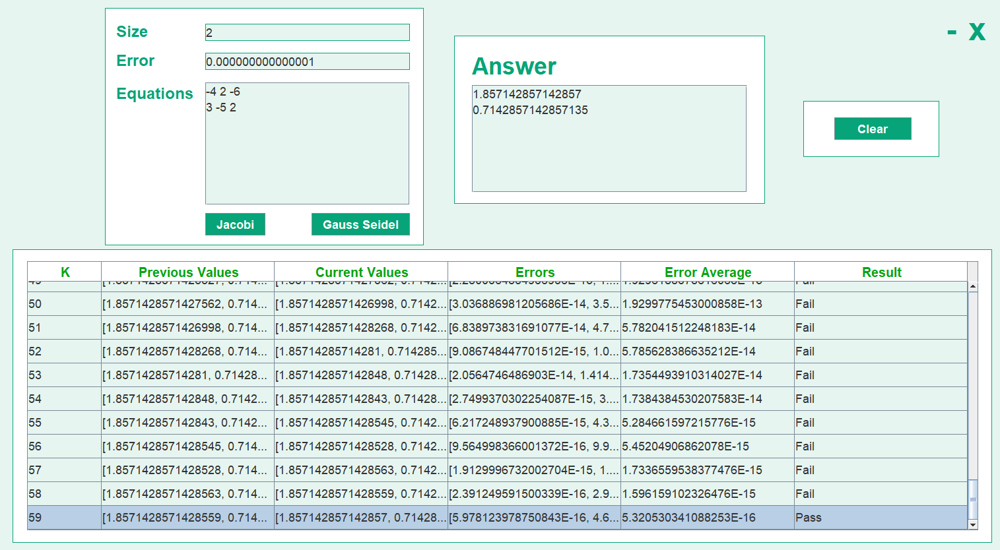
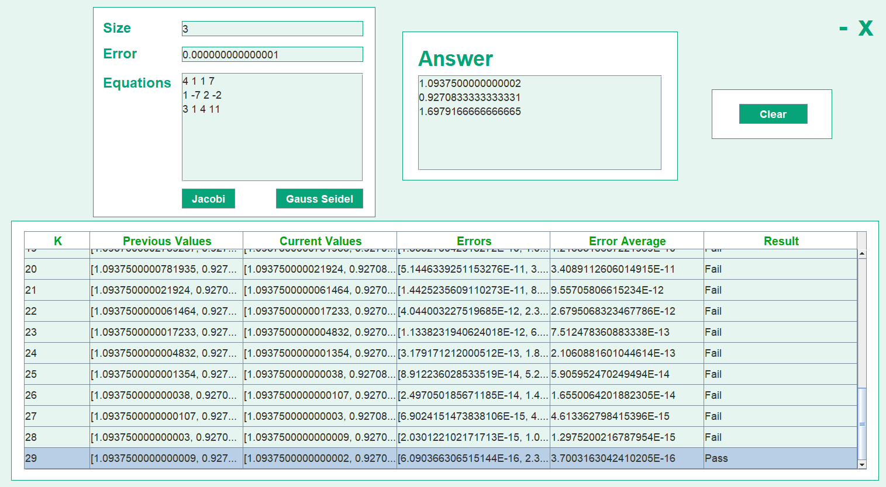

# Jacobi-Gauss-Seidel-Calculator

## Input Requirements

### Size
- integer
- greater than or equal to 2

### Error
- integer or double
- between 0 to 100

### Equations
- integer or double
- number of equations should be the same as size
- number of values per equation should be size + 1
- diagonally dominant

### Example Given to Input solved with Jacobi Method
-4x + 2y = -6 -----> -4 2 -6 
3x - 5y = 2 -----> 3 -5 2

### Example Given to Input solved with Gauss Seidel Method
4x + y + z = 7 -----> 4 1 1 7 
x - 7y + 2z = -2 -----> 1 -7 2 -2 
3x + y + 4x = 11 -----> 3 1 4 11

